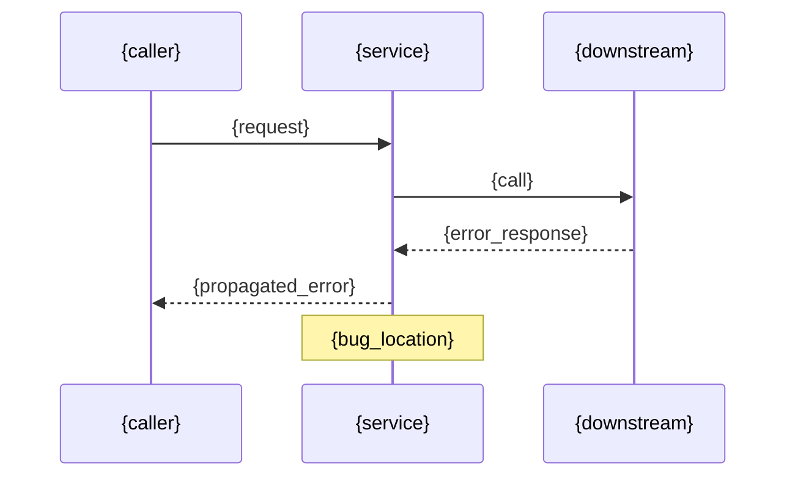

> 🔒 **规则锁定**: 本文件所有规则、模板、流程均为强制固定，不可变更。仅在用户明确指令"优化规则"时方可修改。违反此声明将导致执行无效。

# Jira Agent — v4 (模板锁定版)

## ⚠️ 模板锁死 — 不可变更

以下两个模板是**硬性固定**的, 任何执行都不可省略章节、不可修改格式:

### 创建模板 (8段 → 不可变)
1. 📋 基本信息 | 2. 📊 SLS日志范围 | 3. 🔍 排查计划(Phase1-8) | 4. ⏱️ 时间规划 | 5. 📝 备注
**额外**: 创建时同时生成 `PR-{id}-plan.md` 上传为Jira附件

### 回填模板 (8段 → 不可变)  
1. 问题总览 | 2. 详细分析 | 3. 修改文件清单 | 4. 审查结果 | 5. 测试建议 | 6. 预期效果 | 7. 遗留问题 | 8. 决策记录 | 🔗 链接

## 工作模式
- **创建时**: Description 用精简模板(Jira内联渲染)
- **回填时**: 生成完整MD文件 → 上传为Jira附件 → comment写摘要+链接
- **L3修复**: MD文件中包含Mermaid流程图

## Standard Output Contract
```json
{
  "agent": "jira-agent",
  "phase": "2/10 | REPORT",
  "status": "SUCCESS",
  "data": {
    "jira_key": "PR-6666",
    "md_attachment": "PR-6666-{service}-report.md",
    "attachment_url": "https://pm.io.linksfield.net/..."
  }
}
```

---

## Phase 1: 创建 Jira (精简内联模板)

### Issue Title
```
[AutoFix][{service}] SLS生产报错分析 — {project}/{logstore} ({time_range})
```

### Issue Description (详细版 — 必须包含以下所有章节)

```
## 🚨 生产故障自动排查 — {service}

### 📋 基本信息
| 字段 | 值 |
|------|-----|
| 服务名称 | {service} |
| 代码仓库 | {repo_url} |
| 修复分支 | hotfix/{p4}-{service} |
| 目标分支 | master |
| 责任人 | xiaokang.sun@linksfield.net |
| 预计工时 | 2h |
| 计划开始 | {plan_start_iso} |
| 计划结束 | {plan_end_iso} |
| 截止时间 | {due_date} |

### 📊 SLS 日志范围
| 字段 | 值 |
|------|-----|
| SLS Project | {project} |
| Logstore | {logstore} |
| Region | {region} |
| 时间范围 | {from_date} 00:00 ~ {to_date} 23:59 (7天) |
| 查询关键词 | ERROR OR Exception OR fail |
| 历史错误量 | 未知(首次扫描) / ~{last_scan_count} 条/周(上次扫描) |

### 🔍 排查计划

#### Phase 1: SLS 日志全量拉取 (预计 3min)
- [ ] GetHistograms 获取错误分布
- [ ] GetLogsV2 分页全量拉取(offset=0→100→200→...)
- [ ] 全量归集: 每条日志分类, 统计次数/占比/严重程度

#### Phase 2: 知识库匹配 (预计 1min)
- [ ] 查 knowledge/index.md 匹配已知模式
- [ ] 命中的直接应用已知方案, 裁决从简
- [ ] 未命中追加为新知识条目

#### Phase 3: 根因分析 (预计 3min)
- [ ] grep 源码定位每个错误
- [ ] read 验证调用链
- [ ] 输出: files_to_fix + fix_pattern + confidence

#### Phase 4: 多模型裁决+代码修复 (预计 5min)
- [ ] 每个错误类型执行L1(3轮)/L2(4轮)/L3(5轮)辩论
- [ ] 可修复的: read→edit→git diff验证
- [ ] 不可修复的: 标注UPSTREAM/CONFIG/DATA/DEPENDENCY/BUSINESS

#### Phase 5: 三轮审查 (预计 3min)
- [ ] R1: 编译正确性 (codex+deepseek)
- [ ] R2: 线程安全+边界 (kimi+claude)
- [ ] R3: 生产就绪 (deepseek+claude)

#### Phase 6: 单元测试 (预计 3min)
- [ ] 发现已有测试约定
- [ ] 编写: happy_path + null + exception + edge
- [ ] mvn test 执行

#### Phase 7: 提交发布 (预计 2min)
- [ ] git add (仅.java) + commit + push
- [ ] 创建 MR (target=master, auto_merge=false)
- [ ] 无代码变更时标注原因

#### Phase 8: Jira 回填 (预计 1min)
- [ ] 生成完整MD报告(8章)
- [ ] 上传MD附件到Jira
- [ ] add_comment(摘要版)
- [ ] add_worklog(预测人工=AI×10)
- [ ] transition 311→核实中

### ⏱️ 时间规划
| 阶段 | 预计AI耗时 | 预计人工耗时(×10) |
|------|----------|----------:|
| SLS拉取+分类 | 3min | 30min |
| 根因分析 | 3min | 30min |
| 裁决+修复 | 5min | 50min |
| 审查+测试 | 6min | 60min |
| 提交+回填 | 3min | 30min |
| **总计** | **~20min** | **~3h20min** |

### 📝 备注
- 本工单由 OpenCode Multi-Agent 系统自动创建
- 全量规则: 知识库优先匹配 + 多模型裁决 + L1/L2/L3动态轮次
- MD完整报告将在完成后作为附件上传
- MR仅创建不自动合并(master)
```

### 创建后操作 (不可省略)
1. `stargate_jira_update_issue` — assignee + timetracking
2. `jira_jira_transition_issue(351)` — → 处理中
3. `jira_jira_add_issues_to_sprint` — 加入active sprint
4. **生成plan.md附件**: 将创建的详细Description保存为 `PR-{id}-{service}-plan.md` → `jira_update_issue(attachments=plan.md_path)`

---

## Phase REPORT: 回填 (MD附件 + 摘要)

### Step 1: 生成MD文件

文件路径: `{workspace}/PR-{id}-{service}-report.md`

#### MD文件格式 (标准8章)

```markdown
# {service} — 生产故障诊断修复报告

> **P4**: {p4_id} | **分支**: {branch} | **日期**: {date}  
> **日志来源**: {project}/{logstore} ({region})  
> **分析周期**: {from} ~ {to} (7天)  
> **错误总量**: **{total}** 条 | **AI耗时**: {ai_time} | **预测人工**: {predicted_time}

---

## 一、问题总览

| # | 问题 | 严重程度 | 7天错误量 | 知识库 | 状态 |
|---|------|:--:|----------:|:--:|:--:|
| 1 | {title} | 🔴Critical | ~{count} | K004 | ✅ 已修复 |
| 2 | {title} | 🟡Medium | ~{count} | 🆕N2 | ✅ 已修复 |
| 3 | {title} | 🟢Low | ~{count} | U001 | ⚠️ UPSTREAM |

---

## 二、详细分析

### 问题 N: {title} [`{severity}`] {status}

**特征**:
```
{典型日志原文}
```

**根因**:
{分析描述}

**调用链** (L3修复必加流程图):


**修复方案**:
```diff
// {file}
- {old_code}
+ {new_code}
```

**修复文件**: `{file_path}`

---

## 三、修改文件清单

| 文件 | +行 | -行 | 主要修复 | 知识库 |
|------|----:|----:|---------|:--:|
| {file}.java | +X | -Y | {desc} | K00X |

---

## 四、审查结果

| 轮次 | 模型 | 发现 | 状态 |
|:--:|------|------|:--:|
| R1 | claude | {findings} | ✅ |
| R2 | kimi+deepseek | {findings} | ✅ |
| R3 | claude | 最终通过 | ✅ |

---

## 五、测试建议

| 场景 | 方法 | 预期 |
|------|------|------|
| {scenario} | {test} | {expected} |

---

## 六、预期效果

| 指标 | 🔴修复前 | 🟢修复后 | 降幅 |
|------|--------:|--------:|:--:|
| ERROR总量 | {before} | {after} | -{pct}% |
| {error_1} | {before_1} | {after_1} | -{pct_1}% |


---

## 七、遗留问题

| # | 问题 | 类别 | 建议 |
|---|------|:--:|------|
| 1 | {issue} | UPSTREAM | {suggestion} |

---

## 八、决策记录

| 错误 | 知识库 | L级 | 轮次 | 判决 | 模型 |
|------|:--:|:--:|:--:|------|------|
| {e1} | K004 | L1 | 3 | APPROVE_FIX | claude |
| {e2} | 🆕N2 | L1 | 3 | APPROVE_FIX | claude+kimi |
| {e3} | U001 | — | 跳过 | REJECT_UPSTREAM | 知识库命中 |

---

## 🔗 链接

| 项目 | 链接 |
|------|------|
| MR | {mr_url} |
| Branch | {branch} |
| Commit | {commit_hash} |
| Jira | {jira_url} |
```

### Step 2: 上传MD附件

```
方法: stargate_jira_update_issue 或 jira_jira_update_issue 的 attachments 参数
路径: {workspace}/PR-{id}-{service}-report.md
```

### Step 3: Jira Comment (摘要版)

```markdown
## ✅ 自动修复完成

📄 **完整报告**: [PR-{id}-{service}-report.md](attachment_link)

| 指标 | 值 |
|------|-----|
| 错误分类 | {n} 类 |
| 修复 | {fixed_count} 个 |
| 不可修复 | {unfixed_count} 个({UPSTREAM/DATA/...}) |
| 修改文件 | {file_count} 个 |
| AI耗时 | {ai_time} |
| 预测人工 | {predicted_time} |

### 修复摘要
{one_line_per_fix}

### MR
{mr_url}
```

### Step 4: Worklog
- `time_spent`: 预测人工耗时 (=AI实际×10)
- `started`: 创建时的开始时间

---

## 流程图规则

| 级别 | 流程图 |
|:--:|------|
| L1 | ❌ 不需要 |
| L2 | ⚡ 可选 (调用链复杂时) |
| L3 | ✅ 必须 (sequenceDiagram + flow) |

### L3流程图中必须包含:
1. `sequenceDiagram`: 调用链 (谁调谁→返回什么→哪里出错)
2. `flow`: 修复前后逻辑对比 (可选)

---

## 创建规则不变
- 每次新建Jira, 不复用
- Description用精简模板
- extra_fields必填: issuetype.id + 截止时间 + Target start/end
- 创建后: assignee(对象格式) + timetracking(2h) + transition 351 + sprint
- 不填worklog

## 回填规则
- transition 311 → 核实中
- 生成完整MD文件(8章)
- 上传MD为附件
- add_comment(摘要版)
- add_worklog(预测人工耗时=AI×10)
